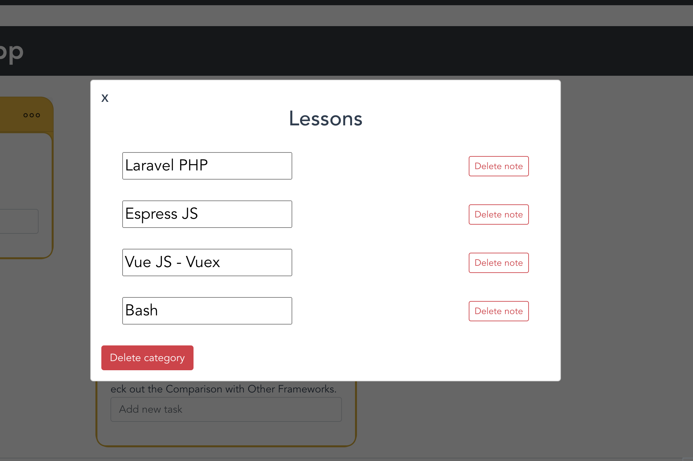
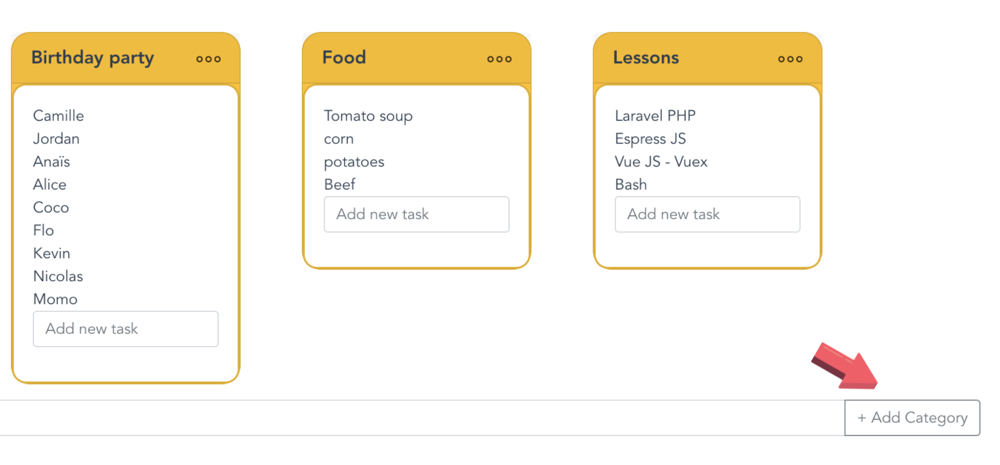
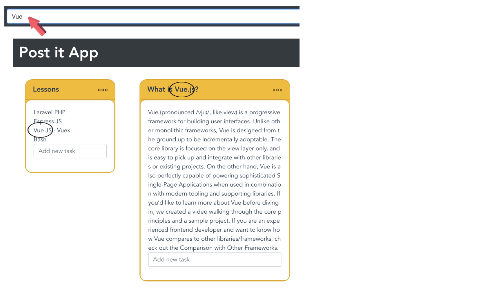

# Post it

## Project setup
```
npm install
```

### Compiles and hot-reloads for development
```
npm run serve
```

### Compiles and minifies for production
```
npm run build
```

### Run your tests
```
npm run test
```

### Lints and fixes files
```
npm run lint
```

### Customize configuration
See [Configuration Reference](https://cli.vuejs.org/config/).

## Presentation

### Simple, efficient and responsive to do list app
You can add a pos-it with a title and a content. Clicking on the right corner, you can delete the post-it or simply remove some content. All your data is save locally in your localStorage and also backed up remotely through an API. 
## Presentation
 

## Modal and remove options
## Presentation
 

## Add category 
 

## Search bar 
 

